# Customize your instance

Most of the data used by the application is retrieved remotely at startup and subsequently updated on a monthly basis.

To prevent data from being loaded on startup and/or recurrently, set the following parameter in
the `application.properties` file:

```ìni
rdp.settings.cache.enabled=false
```

You should deploy your RDP instance at least once to have initial data before setting this property and whenever you
update the software.

## Gene information and GO terms

By default, RDP will retrieve the latest gene information from NCBI, and GO terms
from [Ontobee](http://www.ontobee.org/ontology/OBI). Users genes and GO terms will be updated after a successful update.

Gene information are obtained from [NCBI Gene FTP server](https://ftp.ncbi.nih.gov/gene/DATA/GENE_INFO/)
with URLs stored in the database. You can retrieve these with the following query:

```sql
select taxon_id, scientific_name, gene_url
from taxon;
```

For example, the `gene_url` column for *Homo sapiens* would
contain `ftp://ftp.ncbi.nlm.nih.gov/gene/DATA/GENE_INFO/Mammalia/Homo_sapiens.gene_info.gz`

Genes' GO term annotations are also obtained from NCBI:

```ini
rdp.settings.cache.annotation-file=ftp://ftp.ncbi.nlm.nih.gov/gene/DATA/gene2go.gz
```

GO terms, on the other hand, are obtained from Ontobee:

```ini
rdp.settings.cache.term-file=http://purl.obolibrary.org/obo/go.obo
```

## Taxon

The taxon table is pre-populated during the very first installation of the software, at which time only Human taxon is
activated. To enable other taxon, set their `active` column to `1` in the database.

For example, the following will activate the mouse taxon:

```sql
update taxon
set active = 1
where taxon_id = 10090;
```

Every time the new model organisms are added to the application, they will have to be activated in this manner.

## Ortholog mapping

There is an ortholog mapping file that is included with the application and will automatically populate the database on
startup. The ortholog mappings are based
on [DIOPT](https://bmcbioinformatics.biomedcentral.com/articles/10.1186/1471-2105-12-357).

The default value points to a classpath resource included within RDP archive:

```ìni
rdp.settings.cache.ortholog-file=classpath:cache/DIOPT_filtered_data_May2021.gz
```

It would also be possible to use another ortholog resource, as long as it has the same format. For example, to use the
NCBI gene orthologs:

```ini
rdp.settings.cache.orthologs-file=ftp://ftp.ncbi.nlm.nih.gov/gene/DATA/gene_orthologs.gz
```

As with other remotely downloaded files, this would be updated monthly.

## Profile categories

### Researcher position

Researcher positions can be enabled or disabled by setting the
`rdp.settings.profile.enabled-researcher-positions` to a list of desired values.

For the moment, only one value is defined `PRINCIPAL_INVESTIGATOR`.

```ini
rdp.settings.profile.enabled-researcher-positions=PRINCIPAL_INVESTIGATOR
```

To disable this feature, just leave the setting blank.

### Researcher categories

Researcher categories can be enabled or disabled by setting the
`rdp.settings.profile.enabled-researcher-categories` to a list of desired values.

```ini
rdp.settings.profile.enabled-researcher-categories=IN_SILICO,IN_VIVO
```

The available values are:

- `IN_VIVO`
- `IN_VITRO_BIOCHEMICAL`
- `IN_VITRO_CELLS`
- `IN_VITRO_STRUCTURAL`
- `IN_SILICO`
- `OTHER`

To disable this feature, just leave the setting blank.

### Human organ systems

!!! note

    As of 1.5.0, we recommend that you use an [additional profile category](#additional-profile-categories)
    to add Human organ systems to the user profile.

The Human organ systems ontology is based
on [Uberon multi-species anatomy ontology](http://www.obofoundry.org/ontology/uberon.html)
and updated monthly.

```ini
rdp.settings.cache.organ-file=http://purl.obolibrary.org/obo/uberon.obo
```

Only a select few organ systems are active by default. You can activate more by running the following SQL command with
an Uberon identifier of your choice:

```sql
update organ_info
set active = true
where uberon_id = '<uberon_id>';
```

If you activate a non-default organ system, consider adding an icon for it by following the instructions in
the [Style and static resources](#style-and-static-resources) section below.

To disable organ systems altogether, set the following in your configuration:

```
rdp.settings.organs.enabled=false
```

## Additional profile categories

Support for additional profile categories, including ontologies based on the OBO format, was introduced in the 1.5
series as a way to make the software more flexible and customizable.

Most of the administration of profile categories can be done under the `/admin/ontologies` endpoint, i.e. Manage Profile
Categories page.

To disable this feature altogether, set the following in your `application.properties`:

```ini
rdp.settings.ontologies.enabled=false
```

### Create a simple category

On the Manage Profile Categories page, you may create a simple category. You must provide a name and at most 20 terms.
Each term should have a unique name.

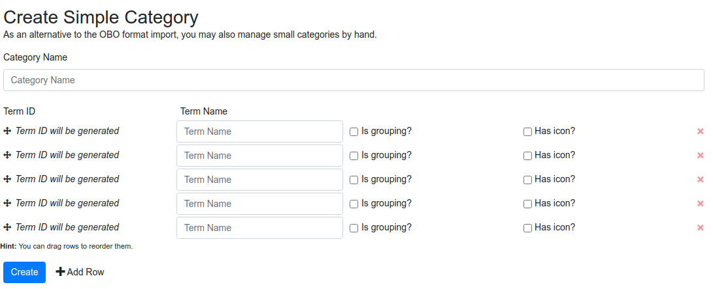

The terms can be organized in groups using grouping terms ("is grouping?"). Simple categories support only one grouping
level. Terms are grouped under the closest preceding grouping term. Groups must not be empty. Grouping terms will not be
used for searching the registry.

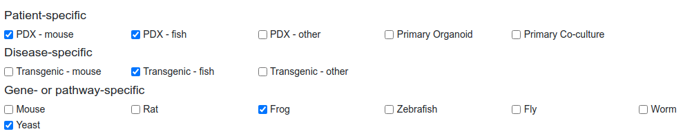

If no grouping is used, terms are displayed in a linear fashion.

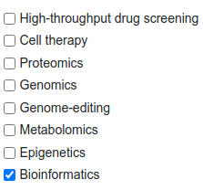

A term can also be associated with an icon. If a category has a mixture of terms with and without icons, those without
will use a SVG textual icon fallback.

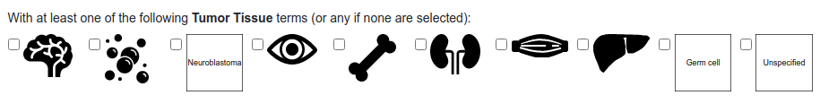

#### Custom icons

To use custom icons, you must first enable custom [style and static resources](#style-and-static-resources) by expanding
the search path for static assets. Then, icons can be deposited
under `static/images/ontologies/{ontologyName}/{termName}.svg`.

Only SVG is supported at this time.

### Create an ontology category

More complex categories are created using ontologies. The ontologies need to be in an OBO format. There are two ways of
importing an ontology: using an URL or a file.

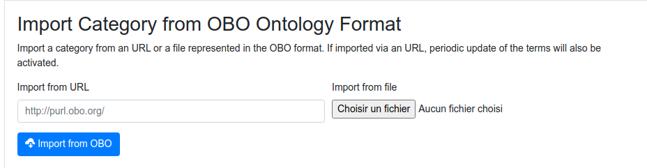

Once imported, you can either activate all ontology terms or a subset of terms
by [activating a subtree](#activating-a-subtree). Note that obsolete terms are never activated automatically.

### Managing profile categories

Once created, a new profile category will be listed in the table at the bottom of the Manage Profile Categories page.
The table uses badges to display if the category is active or not, the number of active terms and if the category is
used as a filter for Gene Search.

The order of categories, as they are displayed on the Profile and Search pages, can be modified using the arrows next to
the category name.

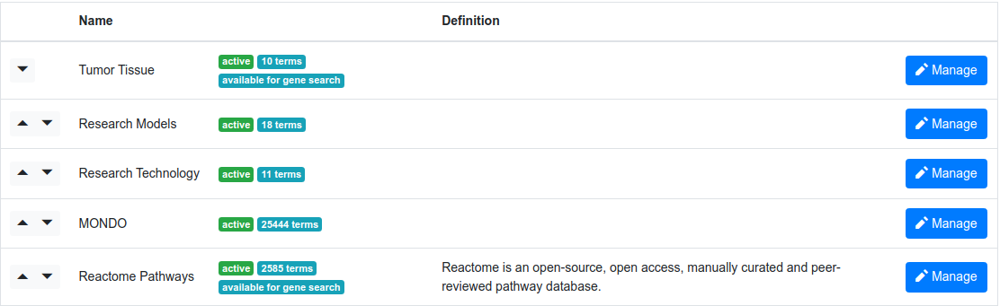

### Managing a specific profile category

A specific profile category can be managed on its Manage Profile Category page, which is accessed by clicking on the
"Manage" button in the table shown above.

The page lists some basic stats at the very top and provides few action buttons:

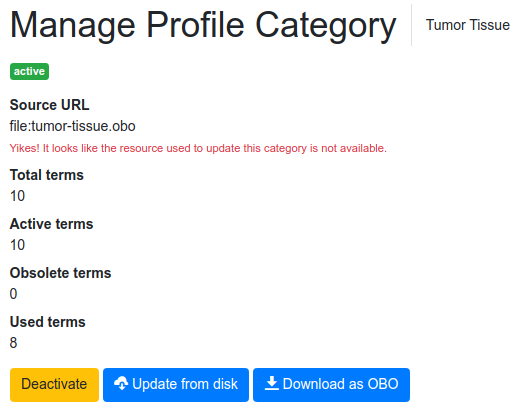

- "Deactivate" (or "Deactivate All Terms" in the case of an ontology category): this will remove the category from the Profile and Search pages. This action is reversible, as the category can be easily re-activated. This action is recommended in cases where a category cannot be deleted because it has already been used by some users.

- Update from "source": Update the ontology category using the original URL (if available)

- Download as OBO: Download the category as an OBO file


The number of used terms indicate how many terms in the ontology have been associated with associated with users.

In the Edit window on the Manage Profile Category page, you can add a definition/description of the category, which
is used in a tooltip on the Profile Page. You can also specify if this category will be used as a filter on the Gene
Search page. While all active categories will be available for the Researcher Search page, only categories that have "Available for gene search" checked will be displayed on the Gene Search page.

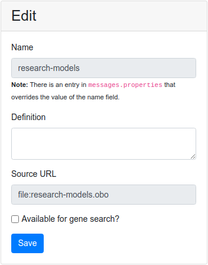

The name and source URL are not modifiable from the admin section, but can be edited directly in the database if needed.

#### Activating a subtree

Ontologies often contain a large number of terms and some of these terms might not be relevant to the users of your
registry. You can chose which parts of an ontology will be used in the registry by activating specific subtrees.
Subtrees can be activated once the ontology is imported, but can also be activated or deactivated later using the Manage
Profile Category pages.

To activate a subtree, enter its root term (or use autocomplete) in the Activate Subtree window.

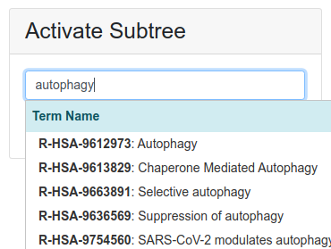

If all possible subtrees are already active, a warning will be displayed instead.

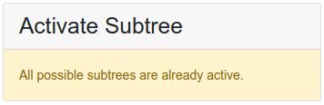

Once activated, the term will then appear in the list of active subtrees:

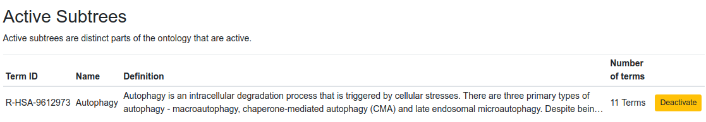

You may deactivate subtree from the table of active subtrees by clicking on "Deactivate".

The active subtrees get a special treatment when the ontology is updated to ensure that newly added sub-terms are always
active.

#### Deleting a category

Deleting a category is irreversible and is only possible if it is not being used (there are no users that are associated
with any of the category terms). If your ontology is being used, consider deactivating it instead.

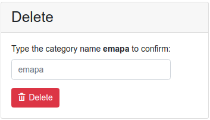

If an ontology has at least one user, the following message will be displayed instead:

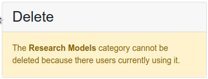

### Custom titles and definitions

The content of `messages.properties` has precedence over the values stored in the database for titles and definitions of
categories and terms. This allows you to override values that are imported from an OBO source as you see fit.

```ìni
rdp.ontologies.{ontologyName}.title
rdp.ontologies.{ontologyName}.definition
rdp.ontologies.{ontologyName}.terms.{termName}.title
rdp.ontologies.{ontologyName}.terms.{termName}.definition
```

Note that we provide defaults for Reactome in the JAR package, so you must use custom messages for overriding those
values. A warning will be displayed in the admin section what this is the case.

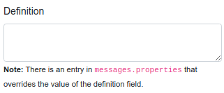

Read more about configuring messages in [Customizing the application messages](#customizing-the-applications-messages)
section of this page.


### Resolving external URLs

By default, ontologies and terms are resolved from [OLS](https://www.ebi.ac.uk/ols/index). Reactome pathways get a
special treatment with the `ReactomeResolver`. You may override this for a different resolver such
as [Ontobee](https://ontobee.org/).

```ìni
rdp.settings.ontology.default-resolver=ubc.pavlab.rdp.ontology.resolvers.OntobeeResolver
```

If you want to use a different source, you can provide a custom implementation of the `OntologyResolver` interface or
ask us by [opening an issue on the RDP GitHub repository](https://github.com/PavlidisLab/rdp/issues).

## Reactome Pathways

[Reactome Pathways](https://reactome.org/PathwayBrowser/) are treated in a slightly different way when it comes to
loading and updating terms.

Under `/admin/ontologies`, you can import the Reactome Pathways category with a single click. The initial import will
download pathways and update term definitions.

The Reactome Pathways category has two additional actions for updating its terms and definitions.

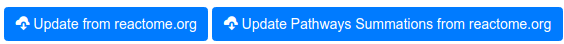

By default, Reactome Pathways use `reactome` as ontology name. This can be adjusted by
setting `rdp.settings.ontologies.reactome-ontology-name` in your configuration.

The various Reactome-related configuration should be left largely untouched. You can use static files by downloading
them and changing the URL scheme to `file:`.

```ìni
rdp.settings.ontology.reactome-pathways-file=file:ReactomePathways.txt
rdp.settings.ontology.reactome-pathways-hierarchy-file=file:ReactomePathwaysRelation.txt
rdp.settings.ontology.reactome-stable-identifiers-file=file:reactome_stable_ids.txt
```

Reactome Pathways are updated at the same frequency as ontology terms. The update is performed in two stages: first the
pathways are updated and then definitions are retrieved from
the [Reactome Content Service API](https://reactome.org/ContentService/#/).

## Loading data from disk

It's also possible to store all the above mentioned info locally, instead of fetching it remotely. The following
settings will retrieve all the necessary files relative to the working directory of the Web application:

```ini
#this setting relates only to gene info files. Files for all taxons will be stord under gene/
rdp.settings.cache.load-from-disk=true
rdp.settings.cache.gene-files-location=file:genes/

#file for GO ontology
rdp.settings.cache.term-file=file:go.obo
#file for gene GO annotation
rdp.settings.cache.annotation-file=file:gene2go.gz
#file for Uberon anatomy ontology
rdp.settings.cache.organ-file=file:uberon.obo
#location of the provided ortholog file which is stored locally by default
rdp.settings.cache.ortholog-file=file:DIOPT_filtered_data_March2020.txt
```

With `rdp.settings.load-from-disk` enabled, the basename from the `gene_url` (mentioned above) will be used in
conjunction with `rdp.settings.gene-files-location`. For example *Homo sapiens* taxon would be retrieved
from `genes/Homo_sapiens.gene_info.gz`

## International data

In order to access the RDMM shared data system (via the international search), your application must use HTTPS. If you
do not have HTTPS setup for you domain, you can consult the following guides on how to set it up:

- [medium.com/@raupach/how-to-install-lets-encrypt-with-tomcat-3db8a469e3d2](https://medium.com/@raupach/how-to-install-lets-encrypt-with-tomcat-3db8a469e3d2)
- [community.letsencrypt.org/t/configuring-lets-encrypt-with-tomcat-6-x-and-7-x/32416](https://community.letsencrypt.org/t/configuring-lets-encrypt-with-tomcat-6-x-and-7-x/32416)

Registries can access each other public data by enabling `rdp.settings.isearch.enabled` and setting up
the `rdp.settings.isearch.apis` in the `application.properties` file to contain a comma-delimited list of partner
registry URLs.

```ini
rdp.settings.isearch.enabled=true
rdp.settings.isearch.apis=https://register.rare-diseases-catalyst-network.ca/
```

A secure communication between different instances is achieved using a special search token which gets appended to
remote queries. Currently, there is one token that is used by all partner registries.

The token can be generated using OpenSSL: `openssl rand -base64 24` and it would look something like
this: `hrol3Y4z2OE0ayK227i8oHTLDjPtRfb4` (this is just an example). Once generated, this token is shared securely with
partner registries.

The token is added to the `application.properties` file in the following way:

```ini
rdp.settings.isearch.search-token=hrol3Y4z2OE0ayK227i8oHTLDjPtRfb4
```

On the receiving side, the partner registry must create a user that is used to perform privileged searches.

This is usually done by creating a remote administrative account:

```sql
insert into user (email, enabled, password, privacy_level, description, last_name, name, shared, hide_genelist,
                  contact_email_verified)
values (concat(rand(), '@rdmm.com'), 0, md5(rand()), 0, 'remote admin profile', '', '', false, false, false);
insert into user_role (user_id, role_id)
values ((select max(user_id) from user), 1);
insert into user_role (user_id, role_id)
values ((select max(user_id) from user), 2);
select max(user_id)
from user;
```

Let's assume that the created user's ID was 522. The partner would then add the token to
its `rdp.settings.isearch.auth-tokens` setting along any existing tokens.

```ini
rdp.settings.isearch.user-id=522
rdp.settings.isearch.auth-tokens=jLb22QZzsaT6/w3xwDHBObmZPypJgXfb,hrol3Y4z2OE0ayK227i8oHTLDjPtRfb4
```

This allows you to query private data from the partner registry when logged in as an administrator on your own registry.

### Out of network partners

To share data with partners outside the RDMM network that may use a different search token or no token at all, you may
use either the `auth` or `noauth` query parameter in the `rdp.settings.isearch.apis` configuration.

To deal with non-admin partners, specify the `noauth` query parameter, which will prevent leakage of the remote search
token from administrative accounts.

```ini
rdp.settings.isearch.apis=https://register.rare-diseases-catalyst-network.ca?noauth
```

If a partner uses a different search token, you may use the `auth` query parameter to specify that token.

```ini
rdp.settings.isearch.apis=https://register.rare-diseases-catalyst-network.ca?auth=jLb22QZzsaT6/w3xwDHBObmZPypJgXfb
```

## Gene Tiers

Users' genes are categorized in tiers based on their familiarity and experience with the gene. This is explained in
detail in the users' documentation and FAQs. Users add TIER1 and TIER2 genes directly, while TIER3 genes are inferred
from GO term associations.

To enable only TIER1 and TIER2, and thus disabling GO terms-related features, add the following to your configuration:

```ini
rdp.settings.enabled-tiers=TIER1,TIER2
```

## Privacy levels

Privacy levels can be selectively enabled for user profiles and genes.

```ini
rdp.settings.privacy.enabled-levels=PUBLIC,SHARED,PRIVATE
rdp.settings.privacy.enabled-gene-levels=PUBLIC,SHARED,PRIVATE
```

Note that any value enabled for genes that is not also enabled for profiles will be ignored.

To allow user to modify the privacy level of their profile and individual genes, set the following properties:

```ini
rdp.settings.privacy.customizable-level=true
rdp.settings.privacy.customizable-gene-level=true
```

To disable gene-level privacy, set `rdp.settings.privacy.customizable-gene-level`
to `false` and leave the `rdp.settings.privacy.enabled-gene-levels` blank.

## Anonymized search results

By default, search results that are not accessible to a given user are anonymized. All identifiable information is
stripped from the model and numerical identifiers are randomized in such a way that it becomes impossible to relate
users or genes from different search.

This feature can be disabled by setting the following configuration key to `false`:

```
rdp.settings.privacy.enable-anonymized-search-results=false
```

## Customizing the application's messages

Some text displayed in RDP can be customized and/or internationalized. To do so, copy a provided `messages.properties`
file in the working directory of the Web application and edit it. The file is found in
[messages.properties](https://github.com/PavlidisLab/rdp/blob/{{ config.extra.git_ref
}}/src/main/resources/messages.properties)

You can use suffixed like `messages_en_CA.properties` for region-specific customization.

Note that `application-prod.properties` and `login.properties` are also used for messages for backward compatibility.
New and existing messages should be moved to `messages.properties`.

With an administrator account, you can refresh messages from the main menu without restarting the registry.

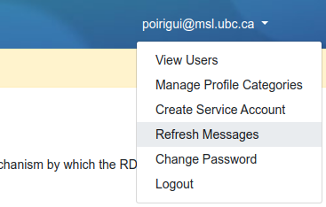

## FAQ

The FAQs can also be customized in a similar way by editing the provided `faq.properties` file and setting up
the `rdp.settings.faq-file` parameter:

```ini
rdp.settings.faq-file=file:faq.properties
```

In the file, each entry requires two parts: `rdp.faq.questions.<q_key>` and `rdp.faq.answers.<q_key>` which hold the
question and the corresponding answer, respectively.

```ini
rdp.faq.questions.<q_key>=A relevant question.
rdp.faq.answers.<q_key>=A plausible answer.
```

The provided default file can be found
in [faq.properties](https://github.com/PavlidisLab/rdp/tree/{{ config.extra.git_ref
}}/src/main/resources/faq.properties).

## Terms of service and privacy policy

The terms of service and privacy policy can be added to the `messages.properties` by editing the following entries:

```ini
rdp.terms-of-service=Your terms of service
rdp.privacy-policy=Your privacy policy
```

## Style and static resources

Static resources can be selectively replaced by including a search directory for Spring static resources.

```ini
spring.resources.static-locations=file:static/,classpath:/static/
```

Here's the list of paths that can be adjusted using the above setting:

```
static/
    images/
        model-organisms/
            <taxon_id>.svg
        organs/
            <uberon_id>.svg
        researcher-categories/
            <researcher_category_id>.svg
        ontologies/
            {ontologyName}/
                {termName}.svg
        brand.png
        favicon-16x16.png
        favicon-32x32.png
        header.jpg
```

To customize static CSS and JavaScript assets, you have to build from sources.

## Building from source

You can customize RDP by editing the publicly available source code and packaging the JAR archive yourself.

To build from sources, you will need a working version of [Node.js](https://nodejs.org/) installed as well as a Java 8+
JDK.

```bash
git clone https://github.com/PavlidisLab/rdp.git
cd rdp/
# edit what you want...
./mvnw package
```

The new build will be available in the `target` directory.

## Editing assets

CSS and JavaScript assets are bundled with [Webpack](https://webpack.js.org/). You may edit the files found
under `src/main/resources/css` and `src/main/resources/js` and then issue a `./mvnw package` command to rebuild the JAR
archive.

Alternatively, you can run `npm` directly:

```bash
cd src/main/resources
npm run build # or 'watch' to build continuously
```