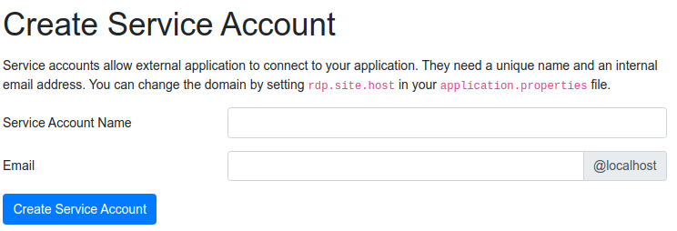
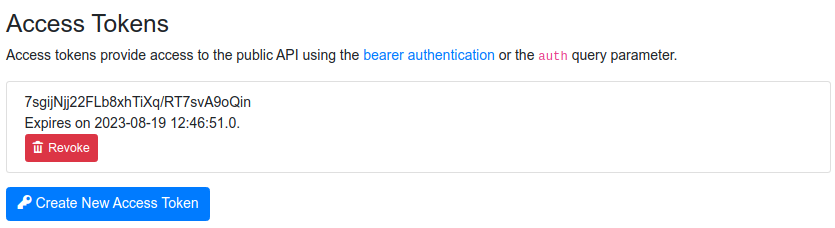

# Service accounts

Using a service account is the preferred way of bridging your registry with external applications.

In our security model, we have three roles: user, administrator and service account. Each provide specific permissions
regarding the search, reading and modification of the registry data.

The service account role confers admin-like permissions, but without the ability to modify data or access administrative
endpoints.

To create a service account, go under `/admin/create-service-account` as an administrator and choose a displayed name
and email. Newly created service account have an access token setup that can be used for accessing your registry through
its [public API](api.md).

You can revoke an access token granted to a service account under its user page in the administration. You can find all
users under `/admin/users`.

